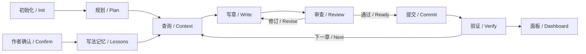

# dsh-story long-form continuity plan

English | [中文](2026-10-04-story-continuity-plan.zh.md)

## Summary

This plan extends the existing `@winterhuan/dsh-story`. It draws on webnovel-writer's complete creative cycle and focused queries so authors can initialize, plan, write, review and retain memory across hundreds of chapters, then inspect current facts and outstanding issues in a read-only dashboard. Acceptance requires recovery across sessions, sources for historical facts, discoverable due foreshadowing and writing constrained by approved outlines. The queries, workflow integration and dashboard are implemented; see the [story package README](../../packages/creative/story/README.md) for usage.

## Table of Contents

- [Scope and current implementation](#scope)
- [Complete creative workflow](#workflow)
- [Facts, plans and memory](#data)
- [Queries and chapter preparation](#query)
- [Read-only dashboard](#dashboard)
- [Implementation order](#implementation)
- [Acceptance and verification](#verification)
- [Later scope](#later)

## Scope and current implementation

Keep `packages/creative/story`, its package name, installation and six Skills. Do not create `dsh-novel` or relocate the package. Preserve existing workspace changes; this plan adds only long-form continuity work. The existing shared-analysis and dedicated story-settings work is covered by the [novel workbench plan](2026-10-04-novel-studio-plan.md).

| Stage | Existing implementation evidence | Addition in this scope |
|---|---|---|
| Initialization and intake | `story`; existing-novel intake; tracking initialization | Consistent entry status and next steps when settings, planning or tracking are missing |
| Settings and volume outlines | `story-write`; long-form planning and outline checks | Connect volume goals, chapter outlines, next-chapter commitments and due foreshadowing to preparation |
| Writing and review | Single-chapter workflow; optional native `chapter.js`; independent review and revision | Shared preparation queries, preserved version checks and consistent stopping and recovery guidance |
| Story memory | Character snapshots, foreshadowing, dual timelines, chapter records and three recent summaries | Focused reads, source lookup and omission notices so continuation does not depend on chat summaries |
| Writing memory | Author memory with book, genre, workflow and global scopes | Route book-specific writing lessons separately from story facts |
| Status and interface | Editable novel file workbench | Read-only overview, characters, foreshadowing and timeline views |

Adapt the preparation–writing–review–extraction–commit cycle in [webnovel-write](../../webnovel-writer/skills/webnovel-write/SKILL.md), focused retrieval in [webnovel-query](../../webnovel-writer/skills/webnovel-query/SKILL.md), reusable lessons in [webnovel-learn](../../webnovel-writer/skills/webnovel-learn/SKILL.md) and read-only presentation in [webnovel-dashboard](../../webnovel-writer/skills/webnovel-dashboard/SKILL.md). Use DSH's native sessions, tools, permissions, delegation and Web host; do not copy Claude-specific calls, a separate server or its database system.

## Complete creative workflow

Users can request any stage independently. Initialization, planning, review, queries and dashboard viewing alone do not start prose generation. An explicit continuation completes and verifies each chapter's commit before starting the next.

1. **Initialize or import**: inspect actual directories and existing materials, then establish the settings and plans required by the task. Initialize a new book at chapter 0; import existing fiction through its actual cutoff without overwriting prose or requiring whole-book analysis.
2. **Plan**: expand the overall outline, volumes, story units and chapter outlines progressively. Chapter outlines constrain goals, choices, payoffs, prohibited developments and stopping points. Resolve missing facts first; refer changes to approved creative direction to the author.
3. **Prepare**: read compact state, the current volume and chapter outlines, the preceding chapter, relevant characters and author-truth/reader-knowledge information. Separately query unresolved foreshadowing due by this chapter. Show sources actually read and the tracking revision.
4. **Write and review**: follow the current outline and retain actual objective-check and semantic-review results separately. The ordinary path keeps prose feedback; native workflow keeps independent review and at most two revision passes. Recheck affected parts after prose changes; old feedback cannot approve a new version.
5. **Extract and commit**: extract character changes, foreshadowing, facts and disclosures, next-chapter commitments and continuity risks from the final text. Use the existing transaction with body/outline hashes and `expected_state_revision`. A failed commit does not advance the next chapter.
6. **Verify and continue**: compare authoritative state with derived views. After interruption, inspect real prose, outlines and tracking to choose the missing stage. Preserve uncommitted drafts and do not infer completion from the last chat message.
7. **Retain writing lessons**: explicitly requested or accepted reusable writing lessons enter the appropriate author-memory scope; inferences remain pending candidates. Successful saving requires the existing memory receipt.

## Facts, plans and memory

Keep each information owner's existing responsibility. Queries and the interface read those owners without introducing another writable story state.

| Information | Authoritative location | Consumption rule |
|---|---|---|
| Approved settings and style | `设定/` | Read relevant material before writing and reviewing; report specific sources when prose conflicts |
| Overall, volume and chapter outlines | `大纲/` | Future plans, never established story facts |
| Prose | `正文/` | Evidence for checks, review and extraction; a file's existence does not establish commitment |
| Committed continuity | `追踪/_tracking-state.json` | Single structured factual state; modified through existing transactions |
| Readable tracking and history | `追踪/上下文.md`, character states, foreshadowing, timelines and chapter records | Existing derived views; locate chapter records or original prose for historical details |
| Author preferences and book-specific lessons | Workspace `.story/作者记忆/` | Existing scopes, candidate decisions, replacement and withdrawal; cannot override story facts |

Current state stores current character snapshots, and chapter records are not complete world snapshots for every chapter. Initial historical queries return actual records and prose sources. Report missing evidence rather than claiming complete state reconstruction at any chapter.

Review conclusions normally live in the session or an ordinary Markdown report; legacy `reader_value_records` are historical data only. The dashboard cannot infer current review approval from them or present file checks, tracking commits or word-count compliance as literary scores.

## Queries and chapter preparation

Add read-only `project status` and `project query` subcommands to the existing `storyctl.py`; see the [query guide](../../packages/creative/story/knowledge/story/skills/story/references/project/continuity-query.md) for exact arguments. Add status, fact lookup and dashboard routing to `story`. Both `story-write` and native workflow Prepare use the same retrieval rules without adding a parallel set of synonymous Skills.

Status includes book title, revision, committed chapter, import cutoff, current volume/time/scene, next-chapter commitments, continuity risks and character/foreshadowing counts. Distinguish uninitialized projects, corrupt state, empty matches and truncated queries. Viewing an uninitialized project does not initialize it.

Focused queries cover current characters, foreshadowing, author truth, reader knowledge and existing records for a selected chapter. Return stable IDs or character names, source paths, cutoff chapter and revision. Lists support filters, pagination, explicit omission counts and the next offset. Search settings and outlines as files rather than guessing authoritative filenames or scanning parent directories for other books.

Existing `active_foreshadow_lines` sorts by importance and displays at most 8 entries. Keep that card capacity and add a separate due query: for the chapter N being prepared, all entries with `status=已埋` and `planned_resolution_chapter <= N` remain retrievable through pagination. List unscheduled foreshadowing separately; exclude resolved, expired and abandoned entries from unresolved results. Sort by due chapter, then importance and ID.

Preparation must consume relevant constraints from the due list. When one response cannot fit them, continue paging or report unchecked items and stop; omitted entries must not mean nonexistent entries. Resolving, postponing or changing an outline remains a semantic decision. A due date does not automatically rewrite prose or update foreshadowing.

Bound each response by entry count and UTF-8 bytes without silently cutting fields. Ordinary writing retains at most three recent summaries and the existing 12 KiB continuation-card cap. Author-memory queries retain their 2048-byte cap. Read additional history only for a specific evidence gap; do not inject the full book or complete state into the writer prompt.

## Read-only dashboard

Add Overview/Files navigation to the existing story workbench. Overview is read-only and the file editor remains available. Reuse the current Session, project discovery and `/story/file` reads without starting another server. Discover long and short fiction only in named immediate-child book directories; the workspace and shared analysis library are not books. Explicitly select among multiple books and never show another book's data after a Session switch.

| View | Content | Author decision it supports |
|---|---|---|
| Overview | Committed progress, current volume and scene, next commitments, risks and three recent summaries | Where to continue and which issues require attention first |
| Characters | Current goals, location, condition, relationships, knowledge and open matters | Whether character behavior and information have support |
| Foreshadowing | Due/overdue items, unscheduled resolutions, status, importance and sources | Which promises need this chapter's attention or later planning |
| Timeline | Separate author-truth and reader-knowledge views | Which facts can be disclosed and which must remain hidden |
| Planning and sources | Discovered settings, volume outlines, chapter outlines and tracking links | Where to verify constraints and records |

Read-only views offer no save, repair, generate or commit actions; refresh only rereads files. Unsupported or corrupt state produces a recoverable error without automatic migration. A read failure retains the same book's prior content with a stale notice; switching book or Session clears the old book. Missing tracking shows initialization/intake guidance rather than a false successful zero-progress state.

Reuse DSH icons, typography, colors and scrolling containers, with English and Chinese locale dictionaries. The initial interface uses progress summaries, lists, filters and expandable details. Show sourced relationship prose without manufacturing graph edges from free text. Paginate large lists and show the new revision after refresh or file changes.

## Implementation order

Implement independently verifiable reads first, connect the creative workflow next, then add the interface. Each stage passes its acceptance criteria before the next starts.

| Stage | Main file scope | Deliverable and acceptance |
|---|---|---|
| 1. Read-only status and queries | `runtime/storyctl.py`, a sibling query module and package script tests | Reuse validation and field definitions from `tracking_commit.py`; cover filters, pagination, due items, missing and corrupt input; reads perform no writes |
| 2. Workflow and writing-memory integration | `skills/story/SKILL.md`, `skills/story-write/SKILL.md`, long-form preparation/daily references, `workflows/chapter.js`, author-memory reference | Ordinary and native workflows consume actual sources and due queries; preserve review, revision, commit and recovery order without duplicate context injection |
| 3. Read-only dashboard | `src/client/workbench.tsx`, new dashboard/read modules, `src/client/locales/`, `src/client/plugin.css`, client tests | Existing file API; complete handling of books, loading, empty/corrupt state, refresh, failures and stale requests; no write requests |
| 4. Integration and delivery | Bilingual package README, necessary HANDOFF additions and relevant tests | Verify installed resources, native workflow and browser interactions; record coverage and remaining limits |

If real long-form samples exceed the current file API size limit, measure them before adding a bounded read-only pagination endpoint. Do not expand general file access preemptively. New modules do not depend on the Creative aggregate and do not modify `upstream/`.

## Acceptance and verification

Use temporary book projects with real tracking fields and observe files and results through actual scripts or client entry points. Isolate directories, processes and browser profiles. Do not use the author's novels, model configuration or profile as test data.

- **Complete cycle**: initialize a book, prepare its first volume and chapter outline, write, review, commit, query and display it. Every stage addresses the same project and revision. Planning or query requests alone do not generate prose.
- **Five hundred chapters**: use a state fixture committed through chapter 500 to retrieve early foreshadowing due in chapter 501, a long-absent character and historical sources. Bound output independently of chapter count. This tests data access, not literary quality across 500 chapters.
- **Foreshadowing omissions**: with more than 8 active entries, due entries of low importance remain discoverable. Pagination has no duplicates or missing entries; unscheduled, resolved and future entries retain distinct meanings.
- **Facts versus plans**: future outlines do not become established facts; author truth remains distinct from reader knowledge; writing memory cannot override the current request, settings or story facts.
- **Failure and recovery**: stale versions, changed prose/outlines, failed transactions, inconsistent derived views and existing drafts never imply completion, advance another chapter or overwrite blindly.
- **Read-only guarantee**: project contents and file inventories remain unchanged after queries, refreshes, switches and dashboard browsing. Tests observe no write API calls, and missing state does not create directories.
- **Real DSH interface**: install story independently and verify two books with same-named chapters, Session switches, refreshes, external updates, read failures, light/dark themes, narrow windows and keyboard access. Check for page script errors.

Run focused package tests as each stage changes. Before committing, run `pnpm run typecheck`, `pnpm run build` and `pnpm test`. Run `pnpm run doc-sync` for documentation and the applicable hygiene checks for UI and exported documentation. Verify client behavior in real DSH using [HANDOFF section 5](../../HANDOFF.md#5-在-dsh-中安装调试和移除); explicitly mark absent browser evidence as unverified.

## Later scope

The initial scope excludes vector databases, embedding services, multi-model scheduling, automatic Git commits, complete historical state reconstruction and literary scores. Design semantic full-text retrieval or structured relationship graphs separately only when actual query cases demonstrate that existing records are insufficient.

## Dev Note

All four implementation stages are complete. The package README and query guide own stable behavior. Native runtime tests execute preparation queries, writing, review, revision and transactional submission; a separate chapter-500 state fixture verifies due foreshadowing, historical sources, pagination and reader knowledge boundaries. No live model was called, so this evidence does not establish long-form literary quality.

`typecheck`, `build` and the full suite of 712 tests in 71 files passed. After the final workspace-read error correction, all 11 dashboard tests and the build passed again. Chrome checks after independent story installation cover multiple books, switching between two actual Sessions, refresh, external updates, read failures, corrupt state, source navigation, draft retention, light/dark themes, 720px/390px layouts and keyboard use. Project content hashes stayed unchanged, with zero write requests and page script errors. Records and screenshots are in `/private/var/folders/b7/m96mgydd5334jqqnhxtw0bmm0000gp/T/dsh-continuity-qa-crjgkb4h/`.
