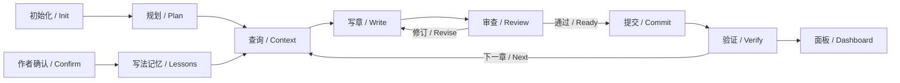

# dsh-story 长篇创作一致性规划

[English](2026-10-04-story-continuity-plan.md) | 中文

## 摘要

本规划以现有 `@winterhuan/dsh-story` 为实施对象，借鉴 webnovel-writer 的完整创作循环与分类查询，让作者能够从开书、规划、写章、审查和记忆沉淀持续推进到数百章，并在只读面板中查看当前事实与待处理问题。核心验收是跨会话可恢复、旧事实有出处、到期伏笔可发现、正文受已确认大纲约束。本规划的查询、流程接入和面板已实现，使用方式见[小说包说明](../../packages/creative/story/README.zh.md)。

## 目录

- [范围与现状](#scope)
- [完整创作流程](#workflow)
- [事实、计划与记忆](#data)
- [查询与写前准备](#query)
- [只读可视化面板](#dashboard)
- [实施顺序](#implementation)
- [验收与验证](#verification)
- [后续范围](#later)

## 范围与现状

沿用 `packages/creative/story`、现有包名、安装方式和六个 Skill；不新建 `dsh-novel`，不移动包目录。工作区已有改动继续保留，本规划只增补长篇一致性流程。现有共享拆文与独立小说设置工作见[小说工作台规划](2026-10-04-novel-studio-plan.zh.md)。

| 环节 | 现有实现依据 | 本次补齐 |
|---|---|---|
| 初始化与接入 | `story`；已有小说接入流程；追踪初始化 | 统一进入长篇流程的状态说明，明确缺少设定、规划或追踪时的下一步 |
| 设定与卷纲 | `story-write`；长篇规划及细纲检查 | 将当前卷目标、章纲、下一章承诺与待回收伏笔串入写前准备 |
| 写章与审查 | 单章流程；可选原生 `chapter.js`；独立评审与修订 | 共用写前查询，保持版本核对，统一失败时的停靠与恢复说明 |
| 事实记忆 | 角色快照、伏笔、双时间线、逐章记录和近三章摘要 | 增加分类读取、来源定位和截断提示，避免只凭聊天摘要续写 |
| 写法记忆 | 作者记忆的 book、genre、workflow、global 范围 | 在入口明确“记住本书写法”与“记录故事事实”的不同归属 |
| 状态与界面 | 可编辑的小说文件工作台 | 增加只读概览、角色、伏笔和时间线视图 |

借鉴 [webnovel-write](../../webnovel-writer/skills/webnovel-write/SKILL.md) 的准备—写作—审查—提取—提交循环、[webnovel-query](../../webnovel-writer/skills/webnovel-query/SKILL.md) 的最窄查询、[webnovel-learn](../../webnovel-writer/skills/webnovel-learn/SKILL.md) 的经验沉淀与 [webnovel-dashboard](../../webnovel-writer/skills/webnovel-dashboard/SKILL.md) 的只读呈现。实现使用 DSH 原生会话、工具、权限、委派与 Web 宿主；不复制其 Claude 专用调用、独立服务器或数据库体系。

## 完整创作流程

用户可以单独请求任一阶段。单独初始化、规划、审查、查询或查看面板都不会自动进入写正文；明确续写时，逐章完成提交验证后再开始下一章。

1. **初始化或接入**：检查实际目录和已有材料，建立当前任务所需的设定与规划。新书从第 0 章初始化追踪；已有小说按真实截止章接入，不覆盖正文、不强制拆解全书。
2. **规划**：按总纲、卷纲、剧情单元、细纲逐步展开。细纲约束本章目标、选择、兑现、禁区与停笔点；缺少关键事实时先补足，变更已确认创作方向时交给作者裁定。
3. **写前准备**：读取紧凑状态、当前卷纲与细纲、上一章正文、本章相关角色与作者真相／读者已知信息，另查本章到期或已逾期的未回收伏笔。展示实际读过的来源和追踪修订号。
4. **写章与审稿**：正文遵循当前细纲，客观检查和语义审稿各自保留实际结果。普通路径沿用自然语言反馈；原生 workflow 沿用独立审稿和最多两轮修订。正文变化后复核受影响部分，旧审稿意见不能批准新版本。
5. **提取与提交**：从定稿提取角色变化、伏笔变化、事实与揭示、下一章承诺和连续性风险，用现有事务绑定正文／细纲哈希及 `expected_state_revision`。提交失败不推进下一章。
6. **验证与接续**：核对权威状态与派生视图。中断后检查真实正文、细纲和追踪，再决定补做哪个阶段；保留未提交稿，不能凭最后一条聊天消息判断已经完成。
7. **沉淀写法**：作者明确要求记住或明确认可的可复用写法进入相应范围的作者记忆；推断只成为待确认候选。保存成功须有现有记忆回执。

## 事实、计划与记忆

各类信息保留现有归属。查询和界面从原始所有者读取，不新建另一份可写的故事状态。

| 信息 | 权威位置 | 使用规则 |
|---|---|---|
| 已确认设定与文风 | `设定/` | 写前和审稿时按需读取；与正文冲突时报告具体来源 |
| 总纲、卷纲与细纲 | `大纲/` | 未来计划；不能当成已经发生的事实 |
| 正文 | `正文/` | 检查、审稿与提取的证据；存在文件不等于已提交 |
| 已提交连续性 | `追踪/_tracking-state.json` | 唯一结构化事实状态；继续通过既有事务修改 |
| 可读追踪与历史 | `追踪/上下文.md`、角色状态、伏笔、时间线、逐章记录 | 既有派生视图；需要历史细节时定位逐章记录或原文 |
| 作者偏好与本书写法 | 工作区 `.story/作者记忆/` | 使用既有范围、候选确认、替换和撤回机制；不能覆盖本书事实 |

当前状态只保存角色的当前快照，逐章记录也不是每章完整世界快照。首版历史查询返回实际记录与原文出处；没有证据时明确说明缺口，不提供虚假的任意章完整状态还原。

审稿结论默认在会话或普通 Markdown 报告中，旧 `reader_value_records` 仅作历史数据。面板不能从它们推导当前章节已经通过审稿，也不能把文件检查、追踪提交或字数达标显示成文学质量评分。

## 查询与写前准备

在现有 `storyctl.py` 增加只读 `project status` 与 `project query` 子命令；具体参数见[查询说明](../../packages/creative/story/knowledge/story/skills/story/references/project/continuity-query.md)。`story` 入口增加状态、查事实和查看面板的路由，`story-write` 与原生 workflow 的 Prepare 使用同一查询规则，不额外增加一组近义 Skill。

状态结果包含书名、修订号、已提交章、导入截止章、当前卷／时间／场景、下一章承诺、连续性风险，以及角色和伏笔数量。必须区分未初始化、状态损坏、没有匹配项和查询被截断；查看缺少追踪的项目不自动初始化。

分类查询覆盖角色当前状态、伏笔、作者真相、读者已知和指定章的已有记录。结果带稳定 ID 或角色名、来源路径、截止章与修订号；列表支持筛选、分页、明确的遗漏数量和下一页位置。设定与大纲仍按文件检索，不凭名称猜出权威文件，也不向父目录扫描其他书。

现有 `active_foreshadow_lines` 按重要度排序并最多展示 8 条。首版保留状态卡的既有容量，新增独立的到期查询：以待写章 N 为基准，`status=已埋` 且 `planned_resolution_chapter <= N` 的条目全部可分页取回；未设回收章的伏笔单列，已回收、已过期和放弃条目不混入待回收列表。展示排序优先到期章，再按重要度和 ID。

写前必须消费到期列表中的相关约束；超过单次输出容量时继续分页，或明确报告尚未检查的条目后停靠，不能将省略当成不存在。是否回收、延期或修改大纲属于语义判断，不由到期日期自动改正文或修改伏笔状态。

单次查询设置条数与 UTF-8 字节上限，不悄悄截掉字段。普通写作继续使用最多三章速记和已有 12 KiB 续写状态卡上限；作者记忆查询沿用 2048 字节上限。只有具体证据缺口才继续读取历史材料，不把全书正文或完整状态塞入写手提示。

## 只读可视化面板

在现有“小说工作台”增加“概览／文件”切换，概览是只读视图，文件编辑器继续保留。复用当前 Session、项目发现和 `/story/file` 读取，不启动独立服务器。长篇与短篇只识别工作区直接子层的作品名称目录，工作区与共享拆文库不算作品；多本书显式选择，切换 Session 不沿用另一书的数据。

| 视图 | 展示内容 | 作者能据此决定什么 |
|---|---|---|
| 概览 | 已提交进度、当前卷与场景、下一章承诺、风险、近三章速记 | 从哪里继续、有哪些事项要先处理 |
| 角色 | 当前目标、位置、状态、关系、已知信息与未结事项 | 本章人物行为与信息范围是否有依据 |
| 伏笔 | 到期／逾期、未定回收章、状态、重要度和来源 | 哪些承诺需要本章或后续规划处理 |
| 时间线 | 作者真相与读者已知分开查看 | 哪些事实可以揭示、哪些仍需保留 |
| 规划与来源 | 已发现的设定、卷纲、细纲和追踪文件入口 | 去哪里核实约束和记录 |

只读视图没有保存、修复、生成或提交操作；刷新只重读文件。状态结构不支持或内容损坏时显示可恢复错误，不自动迁移。读取失败保留同一本书的上次内容并提示陈旧；切书或切 Session 时清除旧书展示。没有追踪状态时显示初始化／接入提示，不显示虚假的零进度成功状态。

复用 DSH 图标、字体、色彩与滚动容器，文案进入中英文词典。首版以进度概览、列表、筛选和可展开详情呈现；角色关系保留有出处的文字，不从自由文本自动制造关系图边。大列表分页，刷新或文件变化后明确展示新修订号。

## 实施顺序

先实现可独立验证的数据读取，再连接创作流程，最后加界面；每一步先通过自身验收再进入下一步。

| 阶段 | 主要文件范围 | 交付与验收 |
|---|---|---|
| 1. 只读状态和查询 | `runtime/storyctl.py`、新增同目录查询模块、包内脚本测试 | 复用 `tracking_commit.py` 的校验与字段定义；覆盖筛选、分页、到期项、缺失与损坏；读取零写入 |
| 2. 串联流程与写法记忆 | `skills/story/SKILL.md`、`skills/story-write/SKILL.md`、长篇准备／日更参考、`workflows/chapter.js`、作者记忆参考 | 普通与原生流程都消费实际来源和到期查询；保持审稿、修订、提交与恢复顺序；不重复注入资料 |
| 3. 只读面板 | `src/client/workbench.tsx`、新增面板与读取模块、`src/client/locales/`、`src/client/plugin.css`、客户端测试 | 使用现有文件 API；完整处理多书、加载、空状态、损坏、刷新、失败和过期请求；无写请求 |
| 4. 集成与交付 | 包 README 中英文、必要的 HANDOFF 增补、相关测试 | 核实安装后的资源、原生工作流和浏览器交互；记录验证范围与剩余限制 |

如现有文件 API 的大小上限不能容纳真实长篇状态，先用样本测量，再增加有预算的只读分页接口；不预先扩大通用文件访问范围。新增模块不依赖 Creative 聚合包，也不修改 `upstream/`。

## 验收与验证

行为验收使用带真实追踪字段的临时小说工程，并通过实际脚本或客户端入口观察文件与结果。测试隔离临时目录、进程和浏览器配置；当前用户的小说、模型配置和 profile 不作为测试数据。

- **一条完整链**：新书初始化、首卷与细纲准备、正文、审稿、事务提交、状态查询与面板显示，所有阶段指向同一工程与修订。只请求规划或查询时不生成正文。
- **五百章连续性**：使用已提交至第 500 章的状态夹具，取回早期埋设但第 501 章到期的伏笔，找到久未出场角色和历史来源；输出容量不随历史章数无限增长。该测试验证数据访问，不宣称验证了 500 章文学质量。
- **伏笔遗漏防护**：超过 8 条活跃伏笔时，低重要度的到期条目仍可发现；分页结果无重复无缺项，未定章、已回收和未来项语义正确。
- **事实与计划隔离**：未来细纲不进入已发生事实；作者真相与读者已知分开；作者写法记忆不能覆盖当前请求、设定或故事事实。
- **失败与恢复**：版本过期、正文／细纲改变、事务失败、派生视图不一致和已有未提交稿时，不误报完成、不推进下一章、不盲目覆盖。
- **只读保证**：所有查询、刷新、切换和面板浏览前后，工程文件内容与清单不变；测试监测没有写接口调用，缺失状态不创建目录。
- **真实 DSH 界面**：独立 story 安装后验证两本同名章节作品、Session 切换、刷新、外部更新、读取失败、浅深色、窄窗口和键盘访问；检查无页面脚本错误。

实施时按变更运行包内定向测试；提交前执行 `pnpm run typecheck`、`pnpm run build` 和 `pnpm test`。文档执行 `pnpm run doc-sync`，界面与导出文档执行相应规范检查。客户端行为必须按 [HANDOFF 第 5 节](../../HANDOFF.md#5-在-dsh-中安装调试和移除) 在真实 DSH 验证；缺少浏览器证据时明确列为未验证。

## 后续范围

首版不加入向量数据库、Embedding 服务、多模型调度、自动 Git 提交、全量历史状态重建或文学质量评分。全文语义检索与结构化关系图只在实际查询案例证明现有记录不足时另行设计。

## 开发笔记

四个实施阶段已完成，稳定行为由包 README 与查询说明维护。原生运行时测试实际执行写前查询、写作、审稿、修订和事务提交；500 章状态夹具单独验证到期伏笔、历史来源、分页与读者信息边界。未调用真实模型，不据此推断长篇文学质量。

`typecheck`、`build` 和全量 71 个文件、712 项测试通过；最后补充工作区读取失败的错误提示后，面板 11 项测试与构建再次通过。独立 story 安装后的 Chrome 检查覆盖多书、两个真实 Session 间切换、刷新、外部更新、读取失败、损坏状态、来源导航、草稿保留、深浅色、720px/390px 和键盘操作；工程内容哈希保持一致，写请求与页面脚本错误均为零。验证记录和截图位于 `/private/var/folders/b7/m96mgydd5334jqqnhxtw0bmm0000gp/T/dsh-continuity-qa-crjgkb4h/`。
